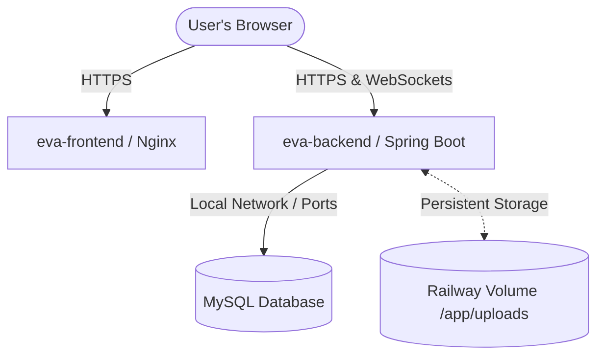

# 🚀 Deploying EVA CRM on Railway (Usage-Based Billing)

This guide provides step-by-step instructions to deploy the complete **EVA CRM** enterprise stack (React frontend, Spring Boot backend, and MySQL database) to your client's own **Railway** account using usage-based (metered) billing.

---

## 🏛️ Deployment Architecture Overview

On Railway, we represent this monorepo as three distinct services running in a single **Project**:
1. **Database Service:** A managed MySQL 8.0 instance.
2. **Backend Service (`eva-backend`):** Spring Boot app built using `/backend/Dockerfile`. Includes a persistent Railway Volume for file uploads.
3. **Frontend Service (`eva-frontend`):** React SPA served via Nginx, built using `/frontend/Dockerfile`.



---

## 💳 Step 1: Set Up Railway Account & Billing
To prevent cold starts (sleeping services) and to scale on usage:
1. Have the client sign up at [Railway](https://railway.app).
2. Navigate to **Settings > Billing** and add a valid payment card.
3. Subscribe to the **Hobby Plan** ($5/month). This plan includes $5 of usage credits and ensures that services run 24/7.
4. Set up budget alerts in **Settings > Billing > Usage Alerts** to ensure billing never exceeds a set threshold (e.g. $10/month).

---

## 🗄️ Step 2: Provision MySQL Database
1. Go to the Railway Dashboard and click **New Project** -> **Provision MySQL**.
2. Railway will create a MySQL database instance.
3. In the project dashboard, you will see a service named **MySQL**.

---

## ☕ Step 3: Deploy and Configure the Backend (`/backend`)
1. Click **New** -> **GitHub Repo** and connect your repository.
2. Select your repository, and click **Configure Service**.
3. Under **Settings**:
   - Change the **Service Name** to `eva-backend`.
   - Set the **Root Directory** to `backend`. (Railway will automatically detect the Dockerfile inside it and build the project).
4. Under **Variables**, add the following environment variables:

| Variable Name | Value / Description | Note |
| :--- | :--- | :--- |
| `SPRING_PROFILES_ACTIVE` | `prod` | Activates production database and compression configurations |
| `JWT_SECRET` | *[Generate a 256-bit secure key]* | Used to sign JWT session tokens |
| `VAPID_PUBLIC_KEY` | *[Your VAPID Public Key]* | Required for Web Push notifications |
| `VAPID_PRIVATE_KEY`| *[Your VAPID Private Key]*| Required for Web Push notifications |
| `ALLOWED_ORIGINS` | `https://your-frontend-domain.up.railway.app` | The public URL of your frontend (comma-separated if multiple) |
| `JAVA_TOOL_OPTIONS` | `-XX:MaxRAMPercentage=75.0 -XX:InitialRAMPercentage=50.0` | **CRITICAL:** Prevents Java from exceeding Railway container memory limits |

5. Under **Volumes**:
   - Click **Add Volume**.
   - Set Mount Path to `/app/uploads`. This ensures uploaded customer receipts and files survive container redeployments.
6. Under **Settings > Networking**:
   - Click **Generate Domain** (or add your custom API domain e.g., `api.evacrm.com`).
   - Copy this URL (e.g., `https://eva-backend-production.up.railway.app`).

---

## ⚛️ Step 4: Deploy and Configure the Frontend (`/frontend`)
1. Click **New** -> **GitHub Repo** and choose the same repository.
2. Under **Settings**:
   - Change the **Service Name** to `eva-frontend`.
   - Set the **Root Directory** to `frontend`. (Railway will automatically build using `/frontend/Dockerfile`).
3. Under **Variables**, add the build-time environment variables:

| Variable Name | Value / Description | Note |
| :--- | :--- | :--- |
| `VITE_API_URL` | `https://eva-backend-production.up.railway.app/api/v1` | Point to the backend URL generated in Step 3 |
| `VITE_WS_URL` | `https://eva-backend-production.up.railway.app/ws` | Point to the backend WebSocket handshake URL |
| `VITE_VAPID_PUBLIC_KEY` | *[Your VAPID Public Key]* | Must match the backend public key |

4. Under **Settings > Networking**:
   - Click **Generate Domain** (or add your custom CRM domain e.g., `crm.evacrm.com`).
5. Copy the generated frontend URL and **update the `ALLOWED_ORIGINS` variable in the Backend Service** to match it.

---

## 🛠️ Step 5: Verification & Operations

### 1. Build Verification
Check the deploy logs for both services in the Railway dashboard.
- The backend should display:
  `Started EvaCrmApplication in X seconds`
- The database schema should migrate automatically. Check for logs containing:
  `HHH000223: Running database schema update`

### 2. Ping Health Check
Open your browser and visit:
`https://your-backend-domain.up.railway.app/health`
Expected response:
```json
{
  "status": "UP"
}
```

### 3. File Upload & Volume Test
1. Log in to the application.
2. Upload a customer receipt (image or PDF).
3. In Railway, go to `eva-backend` -> **Deployments** -> click **Redeploy**.
4. Once restarted, verify the receipt image still loads. If it loads, your persistent Railway Volume is correctly configured!

---

## 🔍 Troubleshooting & Optimization

### 🔴 Problem 1: Backend service keeps crashing with "Exit Code 137" or OOM error
- **Cause:** Spring Boot JVM is exceeding the memory limit allocated by Railway.
- **Solution:** Add `JAVA_TOOL_OPTIONS` environment variable with `-XX:MaxRAMPercentage=75.0` to tell Java to restrict its heap space to 75% of the container limit. If using a 512MB container, this keeps the heap under ~380MB, leaving room for metaspace and OS overhead.

### 🔴 Problem 2: CORS errors in browser console
- **Cause:** The backend is rejecting requests from your frontend URL.
- **Solution:** Double check that `ALLOWED_ORIGINS` in your backend variables matches the frontend URL *exactly* (including `https://` and without a trailing slash `/`).

### 🔴 Problem 3: Push notifications are failing
- **Cause:** Mismatched VAPID keys between frontend and backend.
- **Solution:** Verify that the backend's `VAPID_PUBLIC_KEY` and the frontend's `VITE_VAPID_PUBLIC_KEY` are identical.
