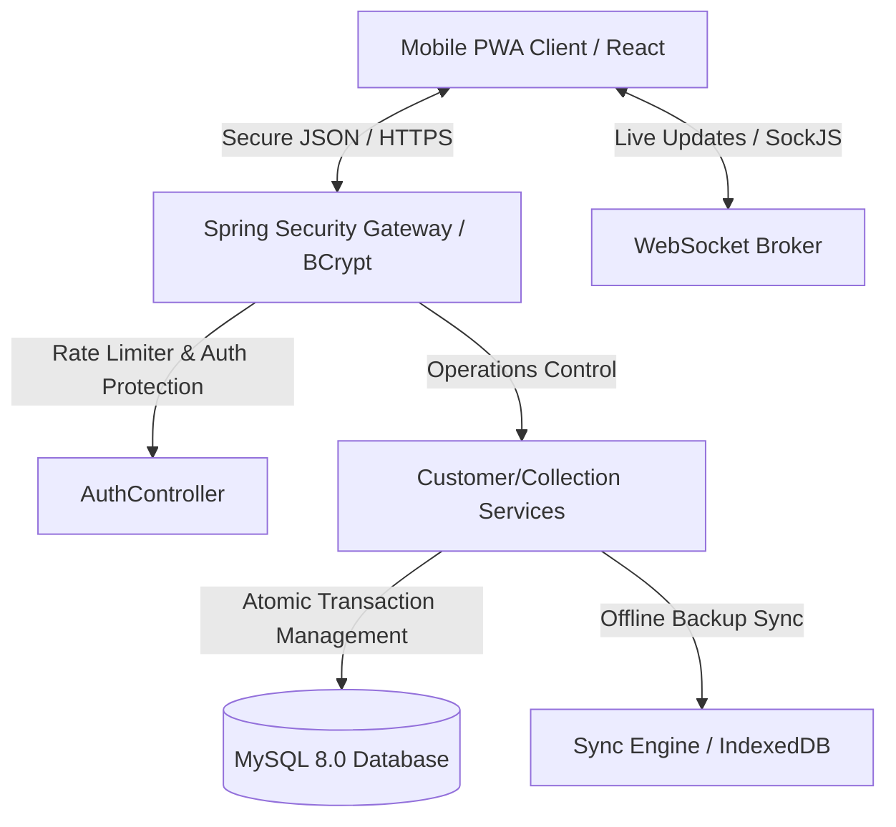

# 🛡️ EVA CRM — Enterprise Debt Collection Platform

EVA CRM is a state-of-the-art, mobile-first Progressive Web Application (PWA) designed for field debt collection and automated customer management. Engineered with spring-loaded transactional integrity, real-time WebSocket synchronization, and high-performance offline processing capabilities, EVA CRM is built to support modern enterprise operational workflows with "Zero-Touch" field onboarding.

🌐 **Live Website:** [https://crm.evagroups.in/](https://crm.evagroups.in/)

---

## 🏗️ System Architecture & Data Flow



---

## ⚡ Key Highlights & Features

1. **Zero-Touch Ingestion:** Excel uploaded customer sheets auto-register missing executive agents with default secure `ROLE_EXECUTIVE` logins.
2. **Offline-First Synchronizer:** Complete IndexedDB integration via Dexie.js allows collectors to operate offline in cellar locations; offline transactions automatically sync when network coverage recovers.
3. **Emergency Administration Recovery:** Includes a secure Master Recovery Key (`EVA-ADMIN-SAFE-2024`) bypassing forgotten admin passwords.
4. **Hardened Production Security:** 
   - **Rate Limiting:** Protects `/auth/login` using a dynamic in-memory sliding-window token-bucket block list.
   - **File Validation:** Restricts uploads to JPEG, PNG, and PDF receipts, capped at 5MB, and sanitized against path-traversal exploits.
   - **Security Headers:** Enforces CSP, X-Frame-Options (DENY), and HSTS native spring constraints.
5. **Operational Dockerization:** One-command orchestration setting up Frontend (served with static Nginx Gzip compression), Spring Boot (running prod profile), and MySQL 8.0 volumes.

---

## 🛠️ Technology Stack

* **Backend Framework:** Spring Boot 3.2.5 (Java 17)
* **Database Layer:** MySQL 8.0
* **Security & Auth:** Spring Security (Stateless JWT token verification, BCrypt password hashing)
* **Real-time Engine:** SockJS + STOMP Messaging
* **Frontend Core:** React 18 (Vite Bundler)
* **Offline Cache:** Dexie.js (IndexedDB)
* **Web server / Proxy:** Nginx with static resource Gzip compression

---

## 📋 Environment Variables Configuration

To run the application, configure the following variables inside `.env` files:

### Backend Configuration (`backend/.env`)
| Variable Name | Description | Default Dev Value |
| :--- | :--- | :--- |
| `DB_URL` | MySQL Connection URL | `jdbc:mysql://localhost:3306/eva_crm` |
| `DB_USERNAME` | Database username credentials | `newuser` |
| `DB_PASSWORD` | Database password credentials | `NewPassword123!` |
| `JWT_SECRET` | 256-bit signature token secret | *Generate secure key* |
| `VAPID_PUBLIC_KEY` | Public VAPID Push Notification key | *Standard VAPID* |
| `VAPID_PRIVATE_KEY`| Private VAPID Push Notification key| *Standard VAPID* |
| `DEFAULT_ADMIN_PASSWORD` | Optional starting password for seeder | `admin123` |

### Frontend Configuration (`frontend/.env`)
| Variable Name | Description | Default Dev Value |
| :--- | :--- | :--- |
| `VITE_API_URL` | Base endpoint URL for Axios client | `http://localhost:8080/api/v1` |
| `VITE_WS_URL` | WebSockets handshake URL | `http://localhost:8080/ws` |

---

## 🐳 Quick Start: Docker Orchestration (Recommended)

Start the entire stack, including the MySQL database, Backend API server, and Frontend Client with Nginx in one command:

```bash
# Run from the root directory
npm run start:prod
```

To view rolling logs:
```bash
npm run logs:prod
```

To spin down containers and retain data volumes:
```bash
npm run docker:down
```

---

## 🧑‍💻 Manual Local Development Setup

### Backend (Spring Boot)
1. Copy `backend/.env.example` to `backend/.env`.
2. Package and run:
   ```bash
   cd backend
   mvn spring-boot:run
   ```

### Frontend (React)
1. Copy `frontend/.env.example` to `frontend/.env`.
2. Install and launch local Dev Server:
   ```bash
   cd frontend
   npm install
   npm run dev
   ```
3. Open `http://localhost:5173` to test.

---

## 📡 API Versioning & Endpoints Summary

All core API operations reside strictly under `/api/v1/`.

### Public / Utility Endpoints
* `GET /health` — Simple health check verification returning `{"status": "UP"}`.
* `POST /api/v1/auth/login` — Stateless JWT authorization (Protected by sliding window rate limiter).
* `POST /api/v1/auth/reset-admin-password` — Emergency administration bypass (Accepts current password OR Master Recovery Key `EVA-ADMIN-SAFE-2024`).

### Protected Endpoints
* `GET /api/v1/customers` — Paginated list of active collections.
* `POST /api/v1/collections` — Upload receipts and log active payments (Sanitized and MIME type gated).
* `DELETE /api/v1/admin/users/{id}` — Safe admin staff removal (Automatically unassigns and cascades assigned clients).

---

## 📱 Mobile PWA Installation Instructions

Ensure you serve the site using **HTTPS** for mobile install prompts:

* **iOS (Safari):** Open domain -> Tap **Share** icon -> Tap **Add to Home Screen**.
* **Android (Chrome):** Open domain -> Click **Add EVA CRM to Home Screen** banner, or open browser settings and tap **Install App**.
